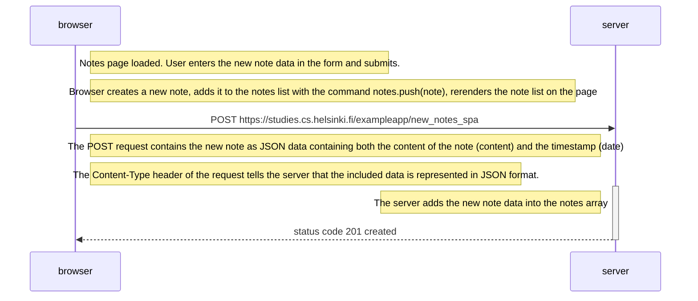

```mermaid
sequenceDiagram
    participant browser
    participant server

    Note right of browser: Notes page loaded. User enters the new note data in the form and submits.
    Note right of browser: Browser creates a new note, adds it to the notes list with the command notes.push(note), rerenders the note list on the page
    browser->>server: POST https://studies.cs.helsinki.fi/exampleapp/new_notes_spa
	
    Note right of browser: The POST request contains the new note as JSON data containing both the content of the note (content) and the timestamp (date)
	Note right of browser: The Content-Type header of the request tells the server that the included data is represented in JSON format.
	
    activate server
	  Note left of server: The server adds the new note data into the notes array
    server-->>browser: status code 201 created
    deactivate server

```